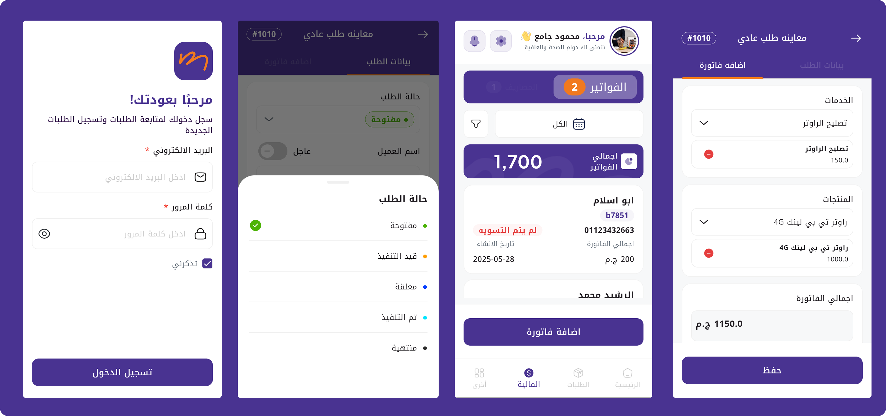

# Mandoop ISP Service Management Application



A comprehensive Flutter-based field service management solution for Internet Service Providers, featuring dual applications for administrators and field technicians with seamless workflow automation.

## Overview

This mobile application system revolutionizes ISP field operations by connecting customers, administrators, and technicians through a streamlined service request workflow. From initial customer reports to final invoice generation, the system ensures efficient communication and task management.

## Key Features

### Dual Application System
- **Admin Application**: Service request management, technician assignment, and operation oversight
- **Technician Application**: Job assignment reception, on-site repair tracking, and invoice generation

### Service Request Workflow
- Customer service request submission with detailed problem descriptions
- job status updates from acceptance to completion
- Digital invoice generation upon service completion

### Communication System
- Real-time chat between admin and technicians using WebSocket in chat room
- Instant notifications for new assignments and status changes
- Photo sharing capabilities for technical documentation

## Tech Stack

| Category | Technology | Purpose |
|----------|------------|---------|
| **Framework** | Flutter (Dart) | Cross-platform development |
| **State Management** | Provider | Predictable state handling |
| **Networking** | Dio | HTTP client with interceptors |
| **Local Storage** | Hive | Lightweight NoSQL database |
| **Dependency Injection** | GetIt | Service locator pattern |
| **Animations** | Lottie | Smooth micro-interactions |
| **Graphics** | Flutter SVG | Scalable vector graphics |

## Performance Achievements

### Operational Efficiency
- **65% faster field operations**: Automated job assignment and routing
- **80% reduction in manual paperwork**: Digital forms and invoicing

### Technical Performance
- **Real-time updates**: WebSocket implementation for instant communication
- **Optimized data usage**: Smart synchronization reduces bandwidth consumption

## System Architecture

### Service Request Flow
```
Customer Report → Admin Dashboard → Technician Accept → On-site Repair → Invoice Generation → Completion
```

## Business Impact

| Metric | Before | After | Improvement |
|--------|---------|-------|-------------|
| **Average Service Time** | 4 hours | 2.5 hours | -37% |
| **Technician Efficiency** | 3 jobs/day | 5 jobs/day | +67% |
| **Customer Response Time** | 24-48 hours | 2-4 hours | -83% |
| **Administrative Overhead** | 30% | 10% | -67% |

## Key Technical Features

### Custom Refresh Indicators
- Brand-consistent design elements across both applications
- Physics-based animations for smooth user interactions

## Security Features

- Secure authentication for both admin and technician access
- Role-based permissions and data access control
- Encrypted data transmission for sensitive customer information
- Audit trail for all service requests and modifications

---

**Note**: This project demonstrates advanced Flutter development capabilities in building enterprise-level field service management solutions while maintaining confidentiality of proprietary business logic.
